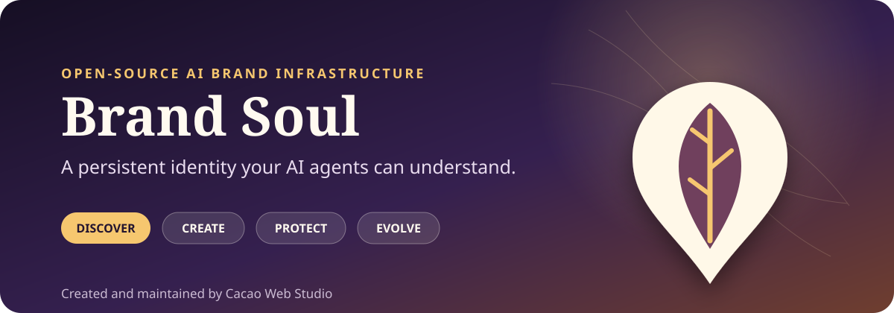
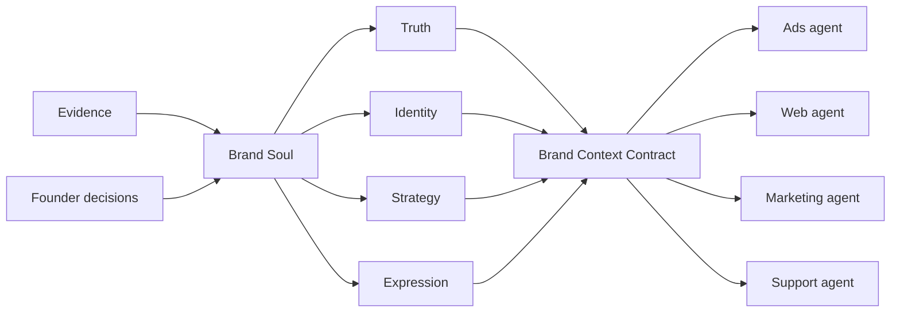

<div align="center">
  

  <br>

  [](LICENSE)
  [](SKILL.md)
  [](#install)
  [](#install)
  [](#install)
  [](#install)

  **Give every AI agent the same durable understanding of your brand.**
</div>

---

# Brand Soul — an open-source framework created by Cacao Web Studio

An open-source framework and Codex Skill for creating and maintaining a brand’s persistent AI identity.

Created and maintained by [Cacao Web Studio](https://cacaowebstudio.com).

Brand Soul discovers or helps define what makes a brand non-interchangeable, records the evidence and human decisions behind it, and turns that knowledge into a portable Source of Truth. Future AI agents can use the same identity without reinterpreting the brand from scratch.

> Brand Soul is not a tone-of-voice generator or an AI mythology machine. It prefers evidence over marketing, decisions over adjectives, tensions over fake consistency, and questions over invention.

## Why Brand Soul?

Most AI workflows begin by reconstructing a brand from scattered websites, old decks, prompts, and assumptions. The result drifts from channel to channel—and unsupported stories quietly become “facts.”

Brand Soul creates a governed layer between the real brand and every AI system acting on its behalf:



## Main capabilities

| Capability | What it does |
|---|---|
| **Discover** | Inspects evidence before interviewing or writing brand copy |
| **Excavate** | Separates enduring identity from old positioning and historical noise |
| **Create** | Helps founders make explicit identity choices for new brands |
| **Structure** | Produces a compact human- and machine-readable Brand Source of Truth |
| **Protect** | Governs facts, claims, contradictions, boundaries, and founder approvals |
| **Evolve** | Updates strategy without silently rewriting truth or protected identity |
| **Audit** | Checks factual, story, identity, voice, cultural, positioning, and decision integrity |
| **Stay distinctive** | Rejects identity language that a competitor could use unchanged |

## One framework, many AI agents

The technical Skill name is **`brand-soul`**. The repository follows the portable Agent Skills structure and works natively with current Agent Skills implementations in Codex, Claude Code, Gemini CLI, and Grok. Any document-capable AI can also use it by reading `SKILL.md` and the routed references.

| Agent | Support | Typical installation |
|---|---|---|
| OpenAI Codex | Native Skill | `~/.codex/skills/brand-soul` |
| Claude Code | Native Agent Skill | `~/.claude/skills/brand-soul` |
| Gemini CLI | Native Agent Skill | `gemini skills install https://github.com/CacaoWebStudio/brand-soul` |
| Grok | Native Skill | `~/.grok/skills/brand-soul` |
| Other AI agents | Portable instructions | Expose the repository and direct the agent to `AGENTS.md` or `SKILL.md` |

See [AI agent compatibility](docs/agent-compatibility.md) for invocation paths and portability boundaries.

## Install

### Codex

```bash
git clone https://github.com/CacaoWebStudio/brand-soul.git ~/.codex/skills/brand-soul
```

Then ask: `Use $brand-soul to build a Brand Source of Truth for my company.`

### Claude Code

```bash
git clone https://github.com/CacaoWebStudio/brand-soul.git ~/.claude/skills/brand-soul
```

Then ask naturally or invoke `/brand-soul`.

### Gemini CLI

```bash
gemini skills install https://github.com/CacaoWebStudio/brand-soul
```

Approve activation when Gemini asks, then use `/skills list` to confirm installation.

### Grok

```bash
git clone https://github.com/CacaoWebStudio/brand-soul.git ~/.grok/skills/brand-soul
```

Then ask naturally or invoke `/brand-soul`.

> Review any third-party Skill before installation. Brand Soul uses network access only for an optional GitHub Release check and a user-authorized update.

## Updates

Brand Soul checks GitHub Releases at most once every 24 hours when an agent session can run Python with network access. The check is read-only, cached, non-blocking, and silent unless a newer stable release exists.

Check manually:

```bash
python3 scripts/check_for_updates.py
```

Install the latest stable release interactively:

```bash
python3 scripts/update_skill.py
```

Opt into a non-interactive update for a trusted scheduler or startup task:

```bash
python3 scripts/update_skill.py --auto
```

The updater requires a clean Git clone of the official repository, targets the tag attached to the latest published stable release, and uses a fast-forward merge. It refuses dirty installations, unofficial remotes, divergent history, and automatic major-version upgrades. Start a new agent session after updating so the new instructions are loaded.

For reproducible projects, keep a version pinned and update deliberately. To receive GitHub notifications, select **Watch → Custom → Releases** on this repository.

Maintainers publish updates in this order:

1. Merge tested changes to `main`.
2. Update both `VERSION` and the `metadata.version` field in `SKILL.md`.
3. Tag the exact release commit as `vX.Y.Z`.
4. Publish a GitHub Release from that tag with meaningful release notes.

The update checker intentionally follows the latest stable GitHub Release, not untagged commits on `main`.

## How it works

Brand Soul operates in four modes:

1. **Build** — discover an existing brand or facilitate deliberate choices for a new one.
2. **Update** — classify new information, preserve history, and route protected changes through approval.
3. **Audit** — test brand-facing work against ten integrity dimensions.
4. **Consume** — let another agent load only the approved context it needs.

The generated repository stays intentionally compact:

```text
brand-soul-<brand>/
├── brand-context.yaml       # machine entrypoint and consumer contract
├── truth.yaml               # atomic, evidence-linked facts
├── identity.md              # protected story, principles, tensions, boundaries
├── voice.md                 # observable language behavior
├── strategy.md              # current, challengeable strategic choices
└── governance/
    ├── evidence.yaml        # source register
    ├── claims.yaml          # repeatability permissions
    ├── issues.yaml          # proposals, gaps, contradictions
    └── decisions/           # rationale for material changes
```

## Quick start

Ask your installed agent to use Brand Soul, or initialize a blank repository directly:

```bash
python3 scripts/initialize_brand_repository.py ./workspace \
  --brand-name "Example Brand" \
  --founder "Founder Name"
```

Validate it at any stage:

```bash
python3 scripts/validate_brand_repository.py ./workspace/brand-soul-example-brand
```

A draft with visible gaps can still be structurally valid. Approval requires an explicit founder review and a SHA-256 binding to the exact protected identity file.

## Integrity model

Brand Soul audits ten dimensions:

- Fact integrity
- Identity integrity
- Story integrity
- Claim integrity
- Boundary integrity
- Cultural integrity
- Voice integrity
- Positioning integrity
- Decision integrity
- Distinctiveness

The deterministic validator checks structure, paths, states, evidence references, and approval hashes. Semantic checks remain reasoning-based because a schema cannot decide whether a story is true or a brand is distinctive.

## Repository map

```text
SKILL.md                     Canonical agent instructions
references/                  Methodology, contract, governance, evaluation
assets/                      Generated Brand Soul repository template
scripts/                     Dependency-free initialization, validation, and safe update utilities
evals/                       Behavioral fixtures and structural tests
agents/openai.yaml           Optional Codex UI metadata
AGENTS.md                    Portable fallback entrypoint
```

## Development

Brand Soul uses Python’s standard library and has no required package installation.

```bash
python3 evals/test_structural.py
python3 evals/test_updates.py
python3 scripts/validate_brand_repository.py assets/brand-repository-template
```

See [CONTRIBUTING.md](CONTRIBUTING.md) before proposing changes. Contributions should improve evidence integrity, portability, governance, or measurable behavior—not add generic brand advice or channel-specific execution.

## Project stewardship

Brand Soul is a public open-source project developed, branded, and maintained by [Cacao Web Studio](https://cacaowebstudio.com).

- Project: [github.com/CacaoWebStudio/brand-soul](https://github.com/CacaoWebStudio/brand-soul)
- Maintainer: [Cacao Web Studio](https://cacaowebstudio.com)
- Citation: [CITATION.cff](CITATION.cff)
- Attribution notices: [NOTICE.txt](NOTICE.txt)

## License

Licensed under the [Apache License 2.0](LICENSE). Copyright 2026 Cacao Web Studio.

Apache-2.0 permits commercial and private use, modification, and distribution under its terms. Cacao Web Studio’s names and marks are not granted for unrestricted trademark use by the license.
